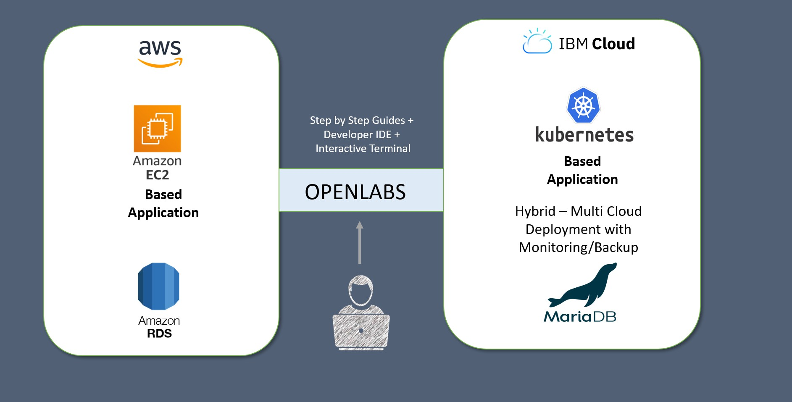
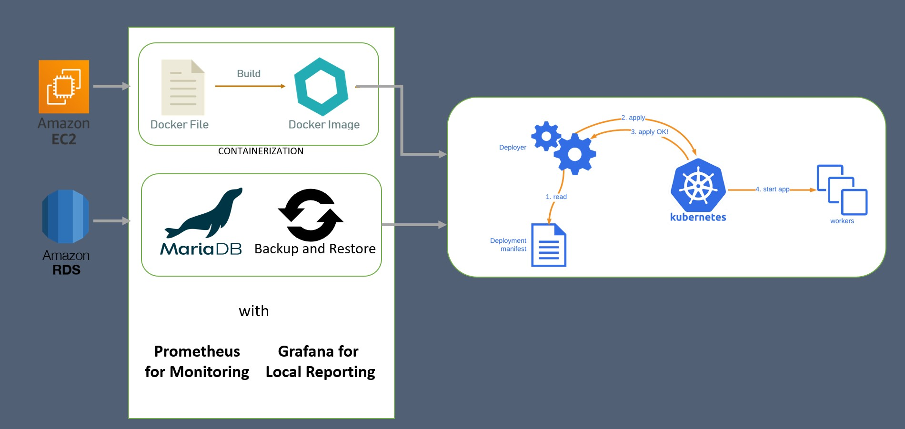

<h1 align="center">Workload Migration</h1> 

This lab guides you through the step by step process of migrating your Amazon RDS workloads to IBM Cloud leveraging opensource technologies deployable on kubernetes as helm-charts or operators.

The process is explained using MariaDB Operator as example.

### Workload Migration from AWS (Lock In) to Open Technology based IBM Cloud (No Lock-in) :  

&nbsp;
  

&nbsp;
 

### Step by Step Guide for Migration:

&nbsp;
 

  

 

<h1 align="center">Mariadb Operator</h1> 

### Overview:

MariaDB Operator is a key technology for MariaDB cloud strategy that assists in creating MariaDB server and database easily by defining basic Custom Resource. This operator enables the customers to deploy MariaDB platform in a variety of database configurations in a Kubernetes environment. 

### Features of MariaDB Operator:

- Setup a MariaDB server with configured version.

- Create a custom database along with a user credential set for the custom database.

- Persistent Volume usage where MariaDB can write its data files.

- Seamless upgrades of MariaDB without loosing existing data.

- Take full backup of Database at user-defined location.

- Schedule backup at regular intervals.

- Monitor metrics for for MariaDB node.

### Objective of tutorial

In this tutorial,we are going to cover following topics:

- Install MariaDB Operator and verify its successful installation.
- Create an instance of MariaDB Operator and verify status of pods and services.
- Access MariaDB Instance and create database tables in MariaDB.
- Schedule backup of MariaDB at regular intervals.
- Enable Monitoring services on MariaDB Server using Prometheus and Grafana Operator.
- Cleanup the Operator resources.

